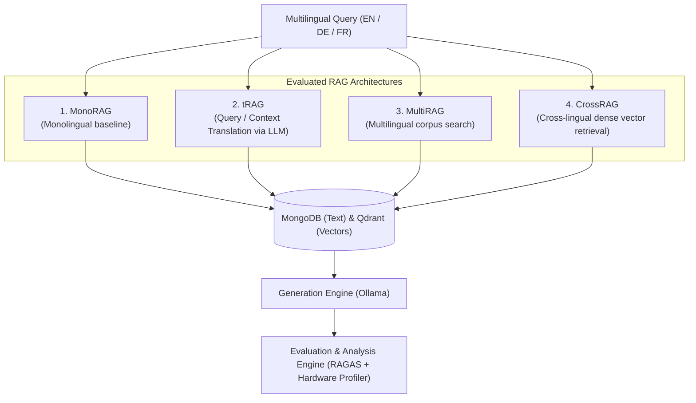

# Crosslingual-RAG: Benchmark & Evaluation Framework

An end-to-end framework for evaluating, comparing, and analyzing **Crosslingual Retrieval-Augmented Generation (CLIR-RAG)** strategies across multilingual question-answering benchmarks (SQuAD FR, XQuAD EN/DE).

---

## 1. System Overview & Strategies

This benchmark quantitatively evaluates four distinct retrieval strategies across languages (English, German, French) assessing retrieval quality, generation fidelity, latency, and hardware overhead:



### Strategy Summary
- **MonoRAG**: Monolingual control benchmark (Query, index, and answer generated in the same target language).
- **tRAG (Translate-RAG)**: Uses machine translation (via Ollama) to bridge language gaps between query and foreign context.
- **MultiRAG**: Queries multi-language collections and aggregates candidate chunks across language boundaries.
- **CrossRAG**: Direct cross-lingual semantic search within a shared multilingual embedding space (`all-MiniLM-L6-v2` / `nomic-embed-text`).

---

## 2. Project Structure

```
Crosslingual-RAG/
├── main.py                         # Central Protocol Monitor (GUI & CLI executor)
├── requirements.txt                # Python dependencies
├── config.py                       # Central configuration (DBs, models, paths)
├── docu/
├   ├── monitor_implementation.md   # Technical spec for the Protocol Monitor        
├   └── hardware_configuration.md   # Technical parameters of the used hardware
└── src/
    ├── config.py                   # Central configuration (DBs, models, paths)
    ├── ingestion/                  # Data loaders (SQuAD FR, XQuAD) & converters
    ├── chunking/                   # Text chunking & document partitioning
    ├── embeddings/                 # Vector embeddings & Qdrant vector store indexing
    ├── retrieval/                  # Implementations of MonoRAG, tRAG, MultiRAG, CrossRAG
    ├── generation/                 # LLM generation prompt handlers (Ollama)
    ├── translator/                 # Language translation modules (Ollama)
    ├── prompts/                    # System prompts for generation, translation & judging
    └── evaluating/
        ├── prepared_questions/     # Prepared test questions for evaluation
        ├── ragas/                  # RAGAS quality metric scoring & LLM-as-a-judge
        ├── hardware/               # CPU, RAM peak/avg metrics & phase latency profiler
        └── analysis/               # Statistical aggregation, CSV tables & publication plots
```

---

## 3. Prerequisites & Setup

### Requirements
- **Python**: 3.10+ (tested on Python 3.10 - 3.14)
- **MongoDB**: Running locally on port `27017`
- **Qdrant**: Running locally on port `6333` (Docker: `docker run -p 6333:6333 qdrant/qdrant`)
- **Ollama**: Running locally on port `11434` with downloaded models:
  ```bash
  ollama pull <TRANSLATION_MODEL>
  ollama pull <GENERATION_MODEL>
  ollama pull <EVALUATION_MODEL>
  ollama pull <EMBED_MODEL>
  ollama pull <EMBEDDING_MODEL>
  ```
- **Tesseract OCR**: Installed (default path: `C:\Program Files\Tesseract-OCR`)

### Installation
```bash
# Clone and enter the repository
git clone https://github.com/Clintbr/Crosslingual-RAG.git
cd Crosslingual-RAG

# Install dependencies
pip install -r requirements.txt
```

---

## 4. User Guide: Running the Pipeline

### Option A: Protocol Monitor GUI (Recommended)
Launch the visual pipeline controller with live terminal trace, dependency guards, and runtime timer:
```bash
python main.py
```
1. Check/uncheck steps you wish to run.
2. Click **`▶ Run All Enabled`** to execute the pipeline sequentially, or click **`▶ Run`** on an individual card.
3. Observe live output, warnings, and progress in the dark console pane.
4. Export execution logs at any time using **`Save Log`**.

### Option B: Headless CLI Mode
Run specific steps or the entire pipeline directly in automated scripts/terminal:
```bash
# Display all available steps
python main.py --cli

# Run a specific step (e.g., Step 9: Analyse Results)
python main.py --step 9

# Run all enabled steps in batch mode
python main.py --all
```

---

## 5. Pipeline Stages (Steps 1 to 9)

| Step | Identifier | Phase | Est. Duration | Description |
| :---: | :--- | :---: | :---: | :--- |
| **1** | `Fetch SQuAD FR` | Ingestion | ~1-2 min | Downloads and saves French SQuAD dataset |
| **2** | `Fetch XQuAD` | Ingestion | ~1-2 min | Downloads English and German XQuAD subsets |
| **3** | `Prepare Documents` | Ingestion | ~5 min | Converts and standardizes documents for DB ingestion |
| **4** | `Data Ingestion` | Ingestion | ~10-15 min | Generates embeddings and populates MongoDB & Qdrant |
| **5** | `Prepare Questions` | Evaluation | ~2 min | Formulates cross-lingual evaluation question sets |
| **6** | `Run RAG Methods` | Evaluation | **~3-4 days** | Executes inference across all 4 RAG architectures |
| **7** | `Ragas Evaluation` | Evaluation | **~3-4 days** | Computes Context Precision, Recall, Faithfulness, Correctness |
| **8** | `Save Hardware Metrics` | Evaluation | ~2 min | Summarizes CPU%, RAM usage (avg/peak), and per-phase latency |
| **9** | `Analyse Results` | Evaluation | ~5 min | Generates statistical CSVs, summary tables, and PDF/PNG charts |

---

## 6. Evaluated Metrics & Analysis Outputs

### Quality Metrics (RAGAS)
- **Retrieval Quality**: `Context Precision`, `Context Recall`, `Context Relevance`
- **Answer Quality**: `Faithfulness`, `Answer Relevancy`, `Answer Correctness`

### Hardware & Efficiency Metrics
- **Memory & Compute**: Average / Peak RAM (MB), Average / Peak CPU (%)
- **Latency Breakdown**: Query Translation, Retrieval, Document Translation, Generation, Total Time

### Output Artifacts
Results are exported to `src/evaluating/analysis_results/`:
- **`tables/`**: Comprehensive CSV tables with descriptive statistics (mean, median, std, quartiles)
- **`figures/`**: Vector (`.pdf`) and raster (`.png`) plots (boxplots, bar charts, trade-off radar charts)

---

## 7. Project Owner Formular & Verification Matrix

> **Note for the Project Owner / Thesis Supervisor**: This section serves as the formal project metadata, environment record, and evaluation handoff checklist.

### Project Information Formular

| Attribute | Specification                                                                      |
| :--- |:-----------------------------------------------------------------------------------|
| **Project Title** | Systematical Evaluation of Crosslingual RAG Architectures                          |
| **Author / Student** | Clint Bryan Nguena                                                                 |
| **Supervisor / Reviewer** | Herr M.Sc. Manuel Groh                                                             |
| **Institution** | Technische Hochschule Mittelhessen, Gießen (Institut für Informationswissenschaft) |
| **Degree / Program** | Bachelor of Science (B.Sc.) in Computer Science                                    |
| **Repository URL** | `https://github.com/Clintbr/Crosslingual-RAG`                                      |
| **Submission Date** | 14 September 2026                                                                  |
