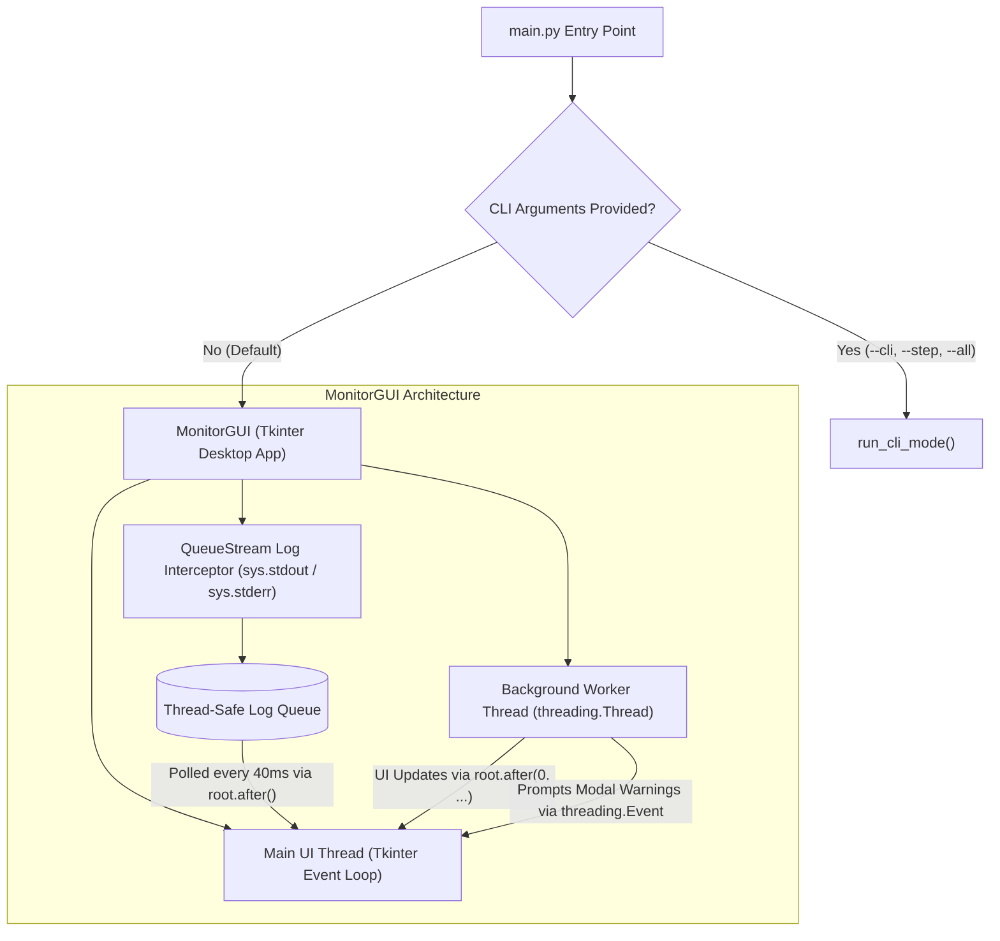

# Crosslingual-RAG Protocol Monitor Implementation Documentation

## 1. Overview & Architecture

The Protocol Monitor in [`main.py`](file:///c:/Clint/Bachelor/Crosslingual-RAG/main.py) serves as the centralized orchestrator and graphical/CLI control center for the entire Crosslingual-RAG evaluation benchmark. It manages the multi-stage pipeline from data ingestion to model inference, automated RAGAS evaluation, hardware benchmarking, and statistical visualization.



---

## 2. Pipeline Steps & Data Model

The pipeline consists of **9 structured steps** categorized into two phases: **Ingestion** and **Evaluation**.

| Step | Name | Phase | Critical | Function / Module | Description |
| :---: | :--- | :---: | :---: | :--- | :--- |
| **1** | `Fetch SQuAD FR` | Ingestion | No | `run_load_data_squad_fr()` | Downloads French SQuAD dataset from Hugging Face |
| **2** | `Fetch XQuAD` | Ingestion | No | `run_load_data_xquad()` | Downloads German & English XQuAD subsets |
| **3** | `Prepare Documents` | Ingestion | No | `run_merger_and_converter()` | Normalizes, merges, and converts documents for databases |
| **4** | `Data Ingestion` | Ingestion | No | `run_ingestion()` | Ingests chunks into MongoDB and vector embeddings into Qdrant |
| **5** | `Prepare Questions` | Evaluation | No | `prepare_questions_for_evaluation()` | Formulates test questions for crosslingual evaluation |
| **6** | `Run RAG Methods` | Evaluation | **Yes (~4 days)** | `run_rag_methods()` | Executes all RAG architectures (tRAG, MonoRAG, MultiRAG, CrossRAG) |
| **7** | `Ragas Evaluation` | Evaluation | **Yes (~4 days)** | `run_ragas_evaluation()` | Computes RAGAS quality metrics (precision, recall, faithfulness, etc.) |
| **8** | `Save Hardware Metrics` | Evaluation | No | `run_save_hardware_metrics()` | Computes and logs CPU and RAM resource metrics |
| **9** | `Analyse Results` | Evaluation | No | `run_analyse_rag_tests_results()` | Generates CSV summary tables and publication-ready Matplotlib plots |

### Step Metadata Structure
Each step is defined in the `steps` list as a dictionary:
```python
step_6 = {
    "step": 6,
    "name": "Run RAG Methods",
    "description": "run rag methods with prepared questions",
    "phase": "Evaluation",
    "enabled": True,
    "is_critical": True,
    "func": 'run_rag_methods',
}
```
Step functions use **lazy imports** inside wrapper functions so heavy libraries (such as `torch`, `sentence_transformers`, `qdrant_client`, or `ragas`) are only loaded when their respective step is executed.

---

## 3. Concurrency & Threading Model

To ensure the desktop UI remains responsive (avoiding "Not Responding" freezes during long calculations or I/O operations), the monitor uses a decoupled threading model:

1. **Main UI Thread**:
   - Manages window rendering, user interactions, layout repainting, and modal dialogs.
   - Periodically polls the log queue (`_process_log_queue` every 40 ms) and updates elapsed runtime (`_update_timer` every 500 ms).

2. **Background Worker Thread (`_worker_run_single` / `_worker_run_all`)**:
   - Executes the selected pipeline steps as a daemon thread (`daemon=True`).
   - Dispatches UI status updates back to the main thread using `self.root.after(0, ...)`.

3. **Thread Synchronization for Modal Dialogs**:
   - When a worker encounters a critical warning or error during batch execution, it communicates with the UI thread via `threading.Event` and a shared mutable dictionary (`confirm_holder` / `user_choice`).
   - The worker schedules `messagebox.askyesno()` on the main thread via `root.after(0, ...)` and pauses (`event.wait()`) until the user clicks Yes or No.

---

## 4. Log Capture & Terminal Trace Widget

### `QueueStream` Redirection
Standard output (`sys.stdout`) and error output (`sys.stderr`) are redirected using a custom `QueueStream` class:
- Passes text to the original stream (console).
- Formats and pushes `(stream_tag, text)` tuples into a thread-safe `queue.Queue`.
- Restores original stdout/stderr handles cleanly when the application closes (`_on_close`).

### Rich Text Formatting & Syntax Tagging
The `_append_to_terminal()` method parses output dynamically:
- **`\r` Handling**: Corrects carriage return progress bars (e.g., `tqdm`) so lines update in place instead of spamming newlines.
- **Dynamic Syntax Highlighting**: Color-codes lines using Tkinter text tags based on content:
  - `ERROR`: Red (`#f87171`) for exceptions, tracebacks, failures.
  - `WARNING`: Yellow (`#fbbf24`) for warnings.
  - `SUCCESS`: Green (`#34d399`) for completion and save confirmations.
  - `STEP`: Blue (`#38bdf8`) for step start headers.
- **Memory Protection**: Caps the terminal line buffer at 10,000 lines, trimming the oldest 2,000 lines when exceeded.
- **Utilities**: Provides **Auto-scroll toggle**, **Clear terminal**, and **Save Log** to `.log` / `.txt` files via file dialog.

---

## 5. Safety Guards & Validation Rules

### Sequence Dependency Validation
When executing a step (e.g., Step 5), `validate_and_confirm_step()` checks if all enabled prior steps ($1 \dots N-1$) have completed successfully:
- If uncompleted prerequisites are detected, a warning modal is triggered:
  > *"Step X is being run out of order. Prior enabled step(s) [...] have not completed yet. Some problems could occur running that step now, are you sure to continue?"*

### Critical Step Warnings
For resource-heavy steps marked with `is_critical=True` (Steps 6 and 7):
- Warns the user of the expected long duration:
  > *"This step take very long to be completed(~4 days), are you sure to continue?"*

### Error Handling & Pipeline Recovery
If a step fails during batch execution (`run_all_enabled`):
- Captures and prints the full traceback to the terminal trace.
- Sets the step status badge to `Failed ✗` (red).
- Prompts the user: *"Do you want to continue with the next steps?"*. If declined, halts remaining pipeline execution gracefully.

---

## 6. User Interface Layout (`MonitorGUI`)

The GUI is designed with a modern light palette (`#f3f4f6`, `#ffffff`) paired with a dark developer console (`#0f172a`):

```
+-----------------------------------------------------------------------------------+
|  Crosslingual-RAG Evaluation Monitor              [ READY ]  [ Completed: 0 / 9 ] |
+-------------------------------------------------+---------------------------------+
| PROTOCOL STEPS         [Run All]  [Stop]   | ⚡ TERMINAL EXECUTION TRACE      |
| [Select All] [Deselect All] [↺ Reset Status]    | [x] Auto-scroll  [Clear] [Save] |
+-------------------------------------------------+---------------------------------+
| Phase: INGESTION                                | > [STEP 1] STARTING...          |
| [x] [Step 1] Fetch SQuAD FR          [Run]    | > Loading squad dataset...      |
|     data fetching from squad_fr      Pending    | > [STEP 1] SUCCESS (2.41s)      |
| [x] [Step 2] Fetch XQuAD             [Run]    |                                 |
| ...                                             |                                 |
| Phase: EVALUATION                               |                                 |
| [x] [Step 6] Run RAG Methods ⚠️ ~4d  [Run]    |                                 |
| ...                                             |                                 |
+-------------------------------------------------+---------------------------------+
| Status: System Idle. Click a step to begin.         Elapsed: 00:00:00  [====    ] |
+-----------------------------------------------------------------------------------+
```

1. **Header Bar**: Displays application title, real-time status badge (`READY` / `RUNNING`), and completed step counter.
2. **Left Panel (Steps Controller)**:
   - Action buttons: Run all enabled, stop, selection toggles, status reset.
   - Scrollable card list grouped by phase. Each card has an enable checkbox, step ID badge, title, critical indicator, individual "Run" button, description, and status pill.
3. **Right Panel (Live Trace Terminal)**:
   - Full dark-themed console with auto-scroll and file export.
4. **Bottom Status Bar**:
   - Human-readable status messages, elapsed session timer (`HH:MM:SS`), and global completion progress bar.

---

## 7. Headless / CLI Execution Mode

The script also provides a CLI fallback for headless environments, automated cron jobs, or batch scripts:

```bash
# Display help and step list
python main.py --help

# Run a specific step by number (e.g. Step 9: Analyse Results)
python main.py --step 9

# Run all enabled steps sequentially in CLI mode
python main.py --all

# Force CLI mode without launching GUI
python main.py --cli
```
